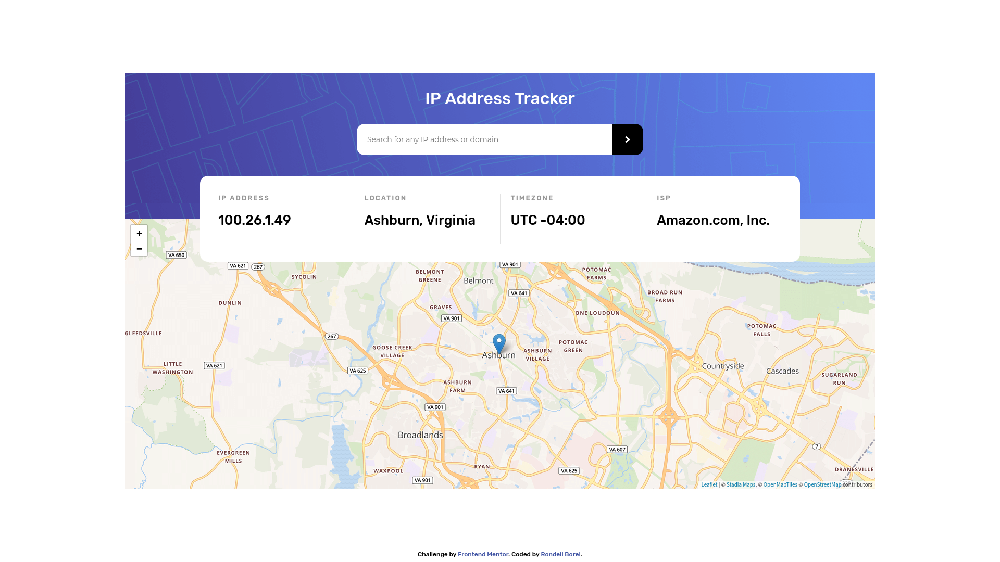
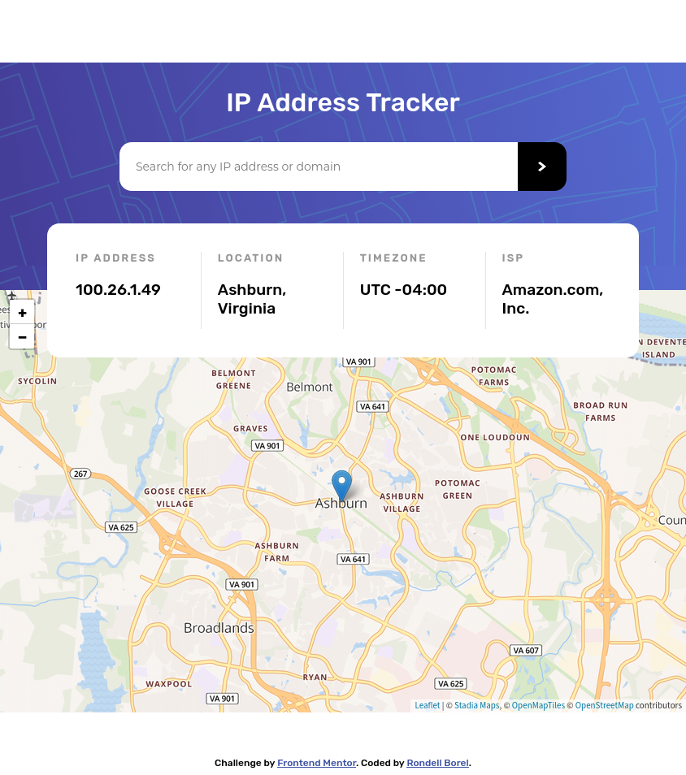
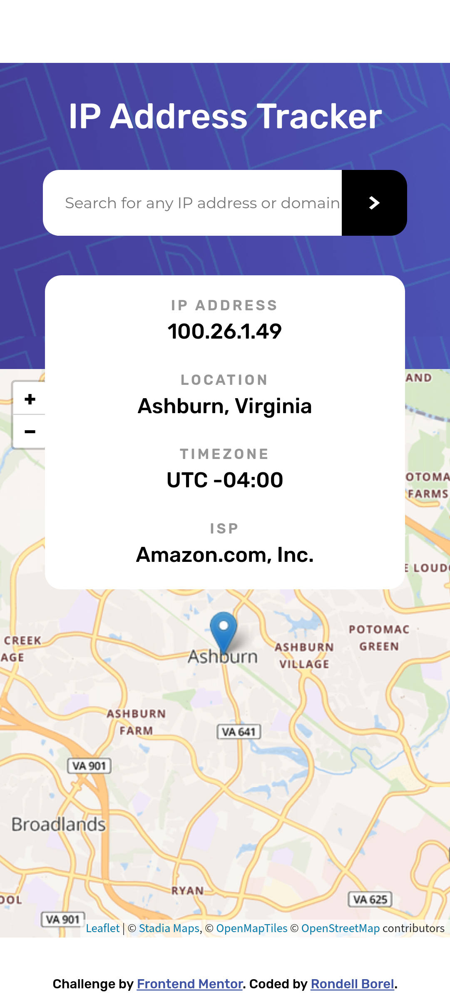

# Frontend Mentor - IP address tracker solution

This is a solution to the [IP address tracker challenge on Frontend Mentor](https://www.frontendmentor.io/challenges/ip-address-tracker-I8-0yYAH0). Frontend Mentor challenges help you improve your coding skills by building realistic projects. 

## Table of contents

- [Overview](#overview)
  - [The challenge](#the-challenge)
  - [Screenshot](#screenshot)
  - [Links](#links)
- [My process](#my-process)
  - [Built with](#built-with)
  - [What I learned](#what-i-learned)
  - [Useful resources](#useful-resources)
- [Author](#author)
- [Acknowledgments](#acknowledgments)

## Overview

### The challenge

Users should be able to:

- View the optimal layout for each page depending on their device's screen size
- See hover states for all interactive elements on the page
- See their own IP address on the map on the initial page load
- Search for any IP addresses or domains and see the key information and location

### Screenshot

- Solution URL: [Frontend Mentor](https://www.frontendmentor.io/solutions/ip-address-tracker-vanilla-html-css-javascript-and-java-backend-TtB_eX3so)
- Live Site URL: [Heroku](https://codergambit-ip-address-tracker.herokuapp.com/)

## My process

### Built with

- Semantic HTML5 markup
- CSS custom properties
- Flexbox
- CSS Grid
- [Spring Boot](https://spring.io/) - Backend
- [Heroku](https://www.heroku.com/) - Hosting

### What I learned
- When there are CORS errors, you have to make the request on the backend
- How to set up a spring boot app on Heroku
- How to properly store and retrieve API keys in a project

### Useful resources

The following resources were very helpful in completing this project
- Deploying a Java app on Heroku - [Heroku](https://devcenter.heroku.com/articles/getting-started-with-gradle-on-heroku), [Callicoder](https://www.callicoder.com/deploy-host-spring-boot-apps-on-heroku/)
- Adding config vars to a heroku app - [Heroku](https://devcenter.heroku.com/articles/config-vars)
- [How to get around the error of Intellij not seeing environment variables set in ~/.bashrc](https://stackoverflow.com/a/58919324)

## Author

- Website - [Rondell Borel](https://www.rondellborel.com)
- Frontend Mentor - [@codergambit](https://www.frontendmentor.io/profile/codergambit)
- Twitter - [@codergambit](https://www.twitter.com/codergambit)
